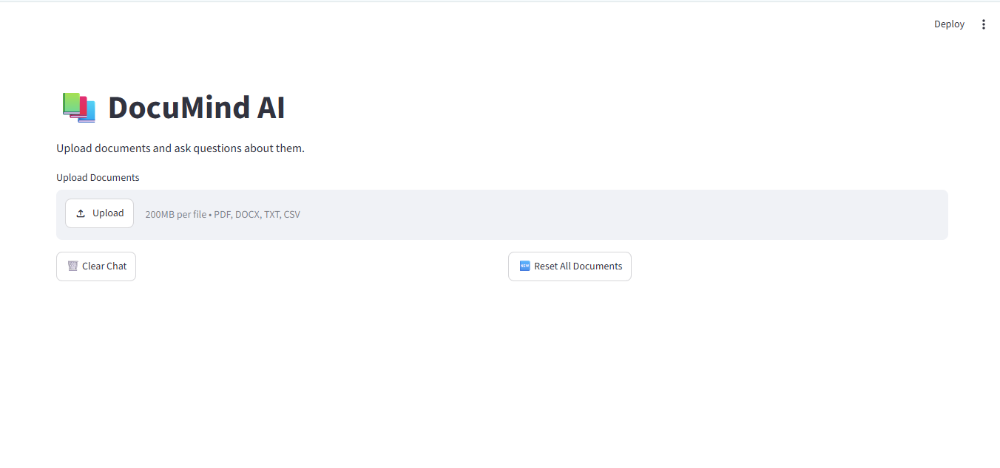
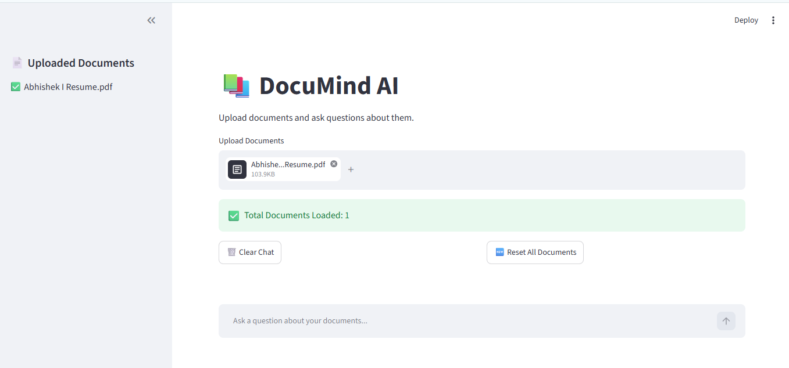
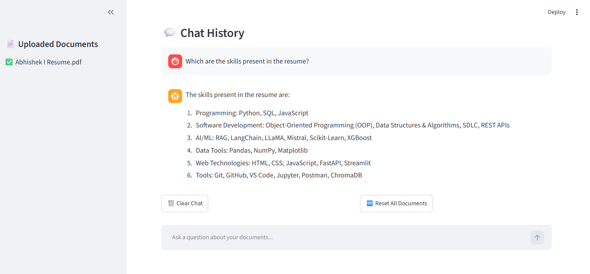

# 📚 DocuMind AI – Intelligent Document Question Answering System using RAG

<p align="center">
  
  
  
  
  
  
</p>

---

## 🚀 Project Overview

**DocuMind AI** is an AI-powered document question-answering system built using **Retrieval-Augmented Generation (RAG)**.

The application allows users to upload documents, extract information, and ask questions in natural language. It retrieves relevant information from uploaded documents and generates accurate answers using a Large Language Model (LLM).

---

## ✨ Features

* 📄 Upload multiple documents
* 📚 Supports PDF, DOCX, TXT and CSV files
* 🔍 Semantic search using embeddings
* 🤖 AI-powered question answering
* 💬 Chat history
* 📂 Multi-document support
* ⚡ Fast retrieval using ChromaDB
* 🎨 User-friendly Streamlit interface
* 🔄 Upload new documents without restarting the application

---

# 🏗 System Architecture

```text
User Uploads Documents
          ↓
Document Loader
          ↓
Text Extraction
          ↓
Text Chunking
          ↓
Embeddings Generation
          ↓
Chroma Vector Database
          ↓
User Query
          ↓
Similarity Search
          ↓
Relevant Chunks
          ↓
Llama 3.2 (LLM)
          ↓
Generated Answer
```

---

# 🛠 Tech Stack

| Component           | Technology                           |
| ------------------- | ------------------------------------ |
| Frontend            | Streamlit                            |
| Backend             | Python                               |
| Framework           | LangChain                            |
| LLM                 | Llama 3.2                            |
| Embedding Model     | mxbai-embed-large                    |
| Vector Database     | ChromaDB                             |
| Document Processing | PyPDF, Docx2txt, Pandas              |
| AI Technique        | Retrieval-Augmented Generation (RAG) |

---

# 📂 Project Structure

```text
DocuMind-AI-RAG
│
├── app.py
├── document_loader.py
├── chunking.py
├── embeddings.py
├── vector_store.py
├── rag_pipeline.py
├── requirements.txt
├── README.md
├── .gitignore
│
├── uploads/
└── chroma_db/
```

---

# ⚙️ Installation

## 1️⃣ Clone Repository

```bash
git clone https://github.com/Abhishek-Kadam07/DocuMind-AI-RAG.git
cd DocuMind-AI-RAG
```

---

## 2️⃣ Create Virtual Environment

```bash
python -m venv venv
```

---

## 3️⃣ Activate Virtual Environment

### Windows

```bash
.\venv\Scripts\Activate.ps1
```

### CMD

```bash
venv\Scripts\activate
```

---

## 4️⃣ Install Dependencies

```bash
pip install -r requirements.txt
```

---

## 5️⃣ Install Ollama

Download:

https://ollama.com/download

---

## 6️⃣ Download Models

```bash
ollama pull llama3.2
ollama pull mxbai-embed-large
```

---

## 7️⃣ Start Ollama

```bash
ollama serve
```

---

## 8️⃣ Run Application

```bash
streamlit run app.py
```

Application will open at:

```text
http://localhost:8501
```

---

# 📖 Usage

## Step 1

Upload documents:

* PDF
* DOCX
* TXT
* CSV

---

## Step 2

Ask questions:

### Examples

```text
Summarize this document.
What are the key points?
Who is the project manager?
What skills are mentioned?
What is the leave policy?
```

---

## Step 3

Ask multiple questions continuously.

---

# 🧠 How RAG Works

1. Documents are uploaded.
2. Text is extracted.
3. Documents are divided into chunks.
4. Embeddings are generated.
5. Embeddings are stored in ChromaDB.
6. User asks a question.
7. Relevant chunks are retrieved.
8. LLM generates an answer.

---

# 📸 Screenshots

## Home Page




## Document Upload




## Question and their answer


 


# 📋 Requirements

* Python 3.11+
* Ollama
* Streamlit
* Internet connection (only for first-time model download)

---


# ⭐ Project Highlights

✅ Retrieval-Augmented Generation (RAG)

✅ Large Language Models (LLMs)

✅ Vector Database (ChromaDB)

✅ Multi-Document Question Answering

✅ Semantic Search

✅ Real-world Generative AI Application

---

 
